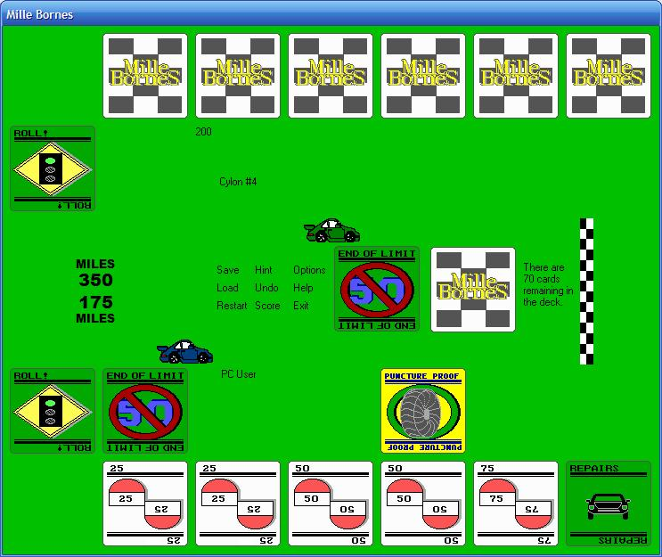



## MilleBornes

### Description

This is an implementation of the classic French card racing game, MilleBornes. I was looking for one here and on the net and couldn&#8217;t find the source, so I wrote some of my own. I&#8217;ve been working on this off-and-on for about four years now. Well, not really four years, because two and a half years ago, my computer got struck by lighting and I lost my HDD and had to start over. I&#8217;m glad it&#8217;s finished. Rules and instructions on how to play are included inside the application.
 
### More Info
 
WARNING: THIS PROGRAM IS NOT DESKTOP SAFE. DO NOT UNZIP THIS PROGRAM TO OR RUN IT FROM THE DESKTOP AS THIS PROGRAM WILL CREATE A COUPLE OF FILES AND A FOLDER. TO INSTALL THIS PROGRAM, UNZIP IT TO C:\PROGRAM FILES\MILLEBORNES OR SOME OTHER LOWER DIRECTORY.

             |
---                |---
**Submitted On**   |2007-07-12 17:44:46
**By**             |[Stephen I\. Ramey](https://github.com/Planet-Source-Code/PSCIndex/blob/master/ByAuthor/stephen-i-ramey.md)
**Level**          |Advanced
**User Rating**    |5.0 (20 globes from 4 users)
**Compatibility**  |VB 6\.0
**Category**       |[Games](https://github.com/Planet-Source-Code/PSCIndex/blob/master/ByCategory/games__1-38.md)
**World**          |[Visual Basic](https://github.com/Planet-Source-Code/PSCIndex/blob/master/ByWorld/visual-basic.md)
**Archive File**   |[MilleBorne2075197122007\.zip](https://github.com/Planet-Source-Code/stephen-i-ramey-millebornes__1-68990/archive/master.zip)

